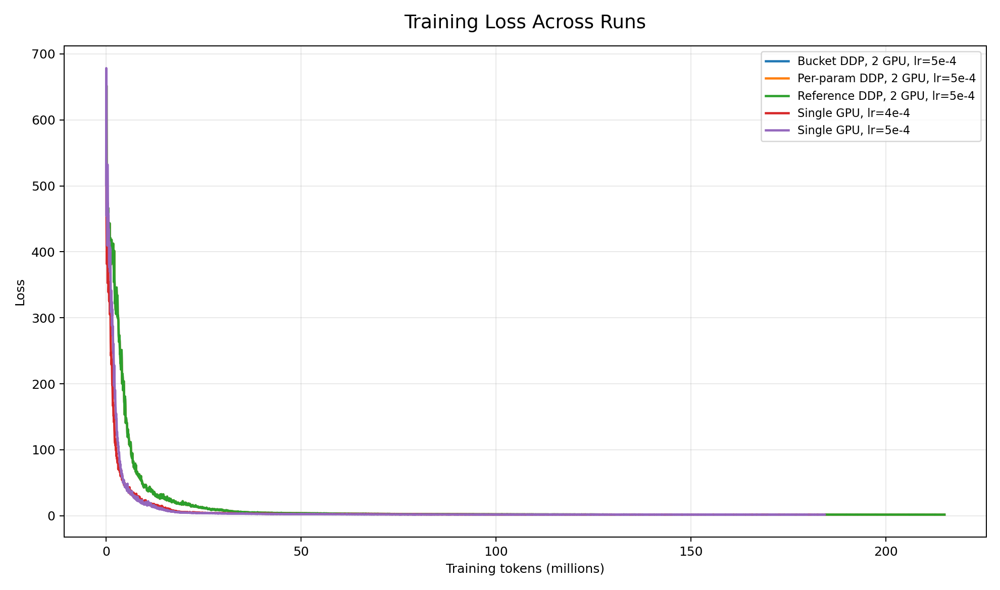
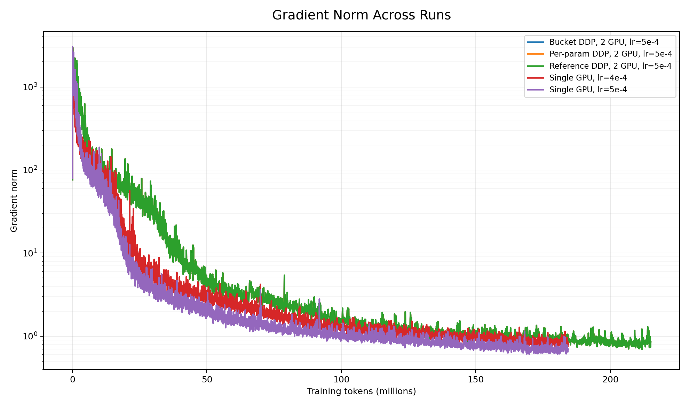

# nanoTitan

**nanoTitan is a Mixture-of-Experts training stack for learning distributed training and CUDA kernel engineering from first principles.**

The repository currently contains a small autoregressive LM, 2D parallelism (DP + PP), a CUDA-backed MoE dispatch path, autograd kernels, and early grouped-GEMM implementations.

---

## What is implemented

### Distributed training

- A per-parameter all-reduce DDP baseline.
- A bucketed reducer with asynchronous all-reduce and autograd hooks.
- Explicit DP and PP process-group construction.
- GPipe-style pipeline parallelism with microbatches.
- 2D DP × PP composition.

### Mixture of Experts

- Top-k routing with renormalized FP32 gate weights.
- Load-balancing loss and per-layer routing statistics.
- CUDA kernels for expert counting, token packing, and weighted combine.
- Custom autograd wrappers and backward kernels for pack and combine.
- FP32, FP16, and BF16 correctness tests for dispatch operations.
- End-to-end pack → combine gradient parity tests.

### CUDA and profiling

- Expert-grouped GEMM forward kernel.
- Grouped-GEMM gradients for inputs and weights.
- Tests covering both up-projection and down-projection matrix shapes.
- Pack/combine microbenchmarks and an Nsight Compute launcher.

---

## Repository layout

```text
nanoTitan/
├── benchmarks/        # CUDA and training microbenchmarks
├── configs/           # Model and parallelism configurations
├── csrc/
│   ├── kernels/       # CUDA dispatch, combine, and GEMM kernels
│   └── runtime/       # C++/CUDA runtime experiments
├── scripts/           # Profiling utilities
├── src/
│   ├── data/          # Packed-token data pipeline
│   ├── model/         # Transformer and MoE implementations
│   └── parallel/      # Data and pipeline parallelism
└── tests/             # Model, CUDA, autograd, and distributed tests
```

---

# ToDO

- [x] DDP
- [x] Benchmark DDP
- [x] Pipeline Parallelism (PP)
- [ ] Benchmark PP
- [ ] Tensor Parallelism (TP)
- [ ] Benchmark TP
- [ ] FSDP
- [ ] Bechmark FSDP

# Benchmark Results

## Model Specs

| Spec                    |       Value |
| ----------------------- | ----------: |
| Total parameters        |         92M |
| Layers                  |          16 |
| Hidden size             |         512 |
| Attention heads         |          16 |
| Head dimension          |          32 |
| FFN hidden size         |       2,048 |
| Vocabulary size         |      50,257 |
| Sequence length         |         768 |
| Optimizer               |        Adam |
| Dataset                 | TinyStories |
| Seed                    |          42 |
| Learning rate           |        5e-4 |
| #training steps (1 GPU) |  6000 steps |
| #training steps (2 GPU) |  3500 steps |

## Benchmark Table

To compute the throughput and timing metrics, we use first 10% of steps as warmup and average over the next 80% of values (Step 350 - 3149 for DDP, Steps 600 - 5399 for Single GPU runs).

| Mode                    | GPU | Total batch size | tokens/sec | step time | Backward time | Number of tokens | Final loss |
| ----------------------- | --: | ---------------: | ---------: | --------: | ------------: | ---------------: | ---------: |
| Bucketed AllReduce DDP  |   2 |               80 |  31,928.99 |    1.9243 |        1.2623 |      215M tokens |     1.7621 |
| Per-param AllReduce DDP |   2 |               80 |  31,448.13 |    1.9537 |        1.2920 |      215M tokens |     1.7621 |
| Reference DDP (Pytorch) |   2 |               80 |  31,888.37 |    1.9267 |        1.2625 |      215M tokens |     1.7621 |
| Single GPU              |   1 |               40 |  16,045.61 |    1.9145 |        1.2500 |      184M tokens |     1.7392 |

## Plots

Loss plot

Grad Norm plot

